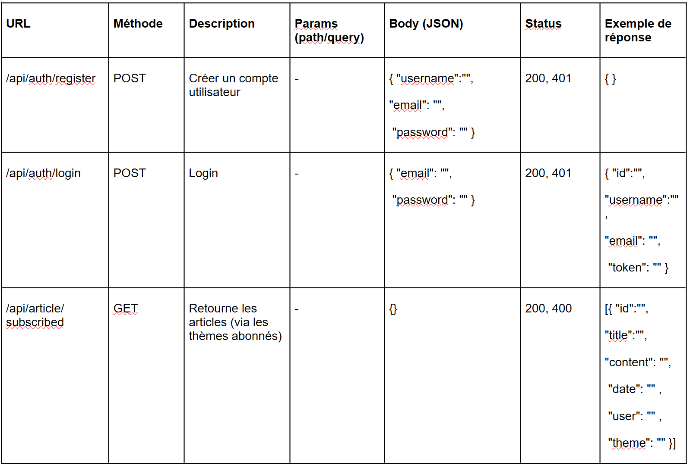
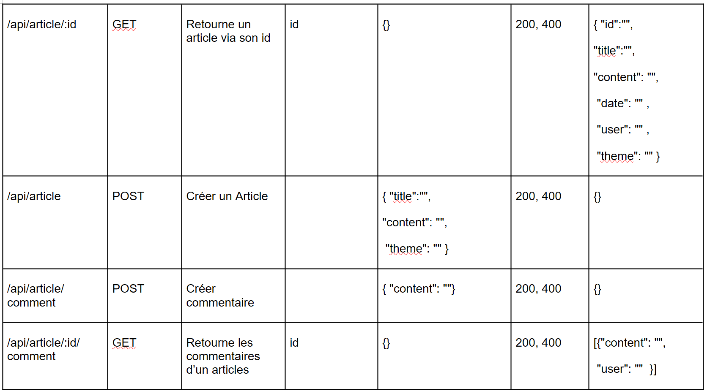
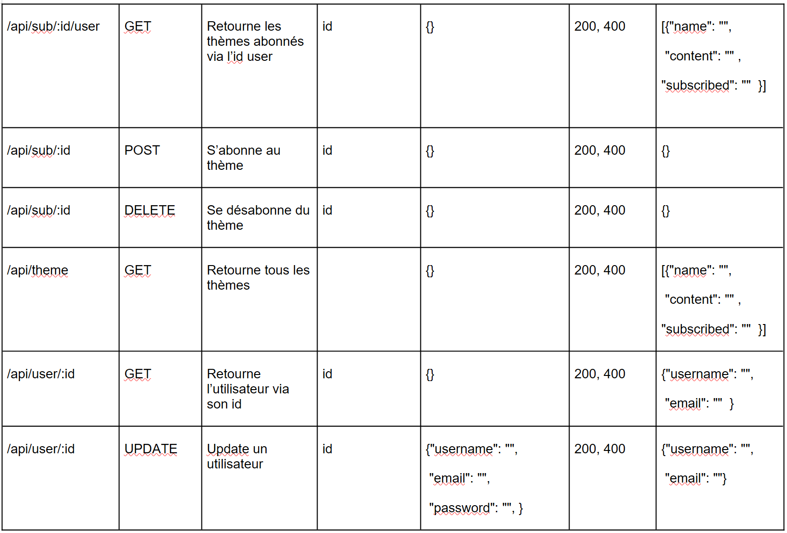

# P5-Mdd

Prototype pour l'application MDD.

MDD est un réseau sociale permetant à ces utilisateurs de publier, comenter et lire des articles.
Les fonctionalités du prototype sont: 
- Inscription
- Connection
- Publier des articles
- Abonnement aux thèmes
- Commenter un article
- Modifier les données utilisateurs

## Front

Pour installer les dépendances frontend (à réaliser avant de lancer l'application):
- Se positionner dans le dossier front (`cd front`).
- Installer le node_modules (`npm install`).

## Base de donnée

- Configurer un fichier application properties pour la connection avec la base de données.
Format du document:
DB_DATABASE=
DB_TEST_DATABASE=
DB_USER=
DB_PASSWORD=
API_KEY=
- Utiliser le script dans 'back/src/main/ressources/sql' pour creer la base de données
- Son nom est 'mdd_db'

### Lancer le projet
Ouvrir deux terminals de commandes:
- Depuis le fichier back, utilisé la commande: 'mvn spring-boot:run'

- Depuis le fichier front, utilisé la commande: 'npm run star'

#### Api

#### Testing

Pour les tests front:

E2e:
- Ouvrir un terminal dans le dossier front.
- Pour les tests Cypress, utiliser la commande: 'npm run e2e:ci'
- Pour le coverage, utiliser la commande: 'npm run e2e:coverage'

Vitest:
- Ouvrir un terminal dans le dossier front.
- Pour les tests, utiliser la commande: 'npm run test'

Pour les tests back:
- Ouvrir un terminal dans le dossier back.
- Pour les tests Cypress, utiliser la commande: 'mvn test'
- Pour le coverage, ouvrir la page "back\target\site\jacoco\index.html'

Pour les tests back, Crée une base de donnée pour les tests avec le script 
dans 'back/src/main/ressources/sql'. Remplacer le nom 'mdd_db' par 'mdd_test'
dans les  deux premiéres lignes.
Utiliser les fichiers csv dans 'back\src\test\resources\sql' pour remplir la base de test.